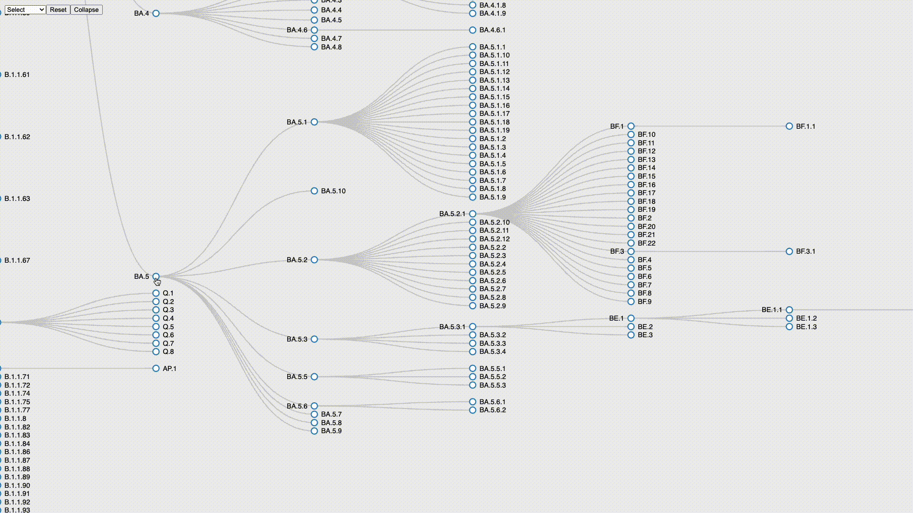
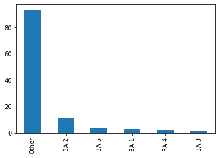

# Pango-collapse 

[](https://pypi.org/project/pango-collapse/)
[](https://github.com/MDU-PHL/pango-collapse/actions/workflows/tests.yaml)

CLI to collapse Pango lineages for reporting

[](https://mdu-phl.github.io/pango-watch/tree/)

## Install 

Install from pypi with pip.

```bash
pip install pango-collapse
```

## Usage

`pango-collapse` takes a CSV file of SARS-CoV-2 samples (`input.csv`) with a column (default `Lineage`) indicating the pango lineage of the samples (e.g. output from pangoLEARN, nextclade, USHER, etc). 

```bash
$ cat input.csv
```
| Lineage  | 
| ---------|
| BA.5.2.1 |
| BA.4.6   |
| BE.1     |

`pango-collapse` will collapse lineages up to the first user defined parent lineage (specified in a text file with `--collapse-file`). If the sample lineage has no parent lineage in the user defined collapse file the compressed lineage will be returned. Collapse up to either `A` or `B` by adding A and B to the collapse file. By default (i.e. if no collapse file is specified) `pango-collapse` uses the collapse file found [here](https://github.com/MDU-PHL/pango-collapse/blob/main/pango_collapse/collapse.txt). This file is dependant on the version of `pango-collapse`, use `--latest` to load the latest version of the collapse file from github at run time. 

```bash
$ cat collapse.txt
```
```
BA.5
BE.1 
```

`pango-collapse` will produce an output file which is a copy of the input file plus `Lineage_full` (the uncompressed lineage), `Lineage_expanded` (the expanded lineage format) and `Lineage_family` (the lineage collapsed up to) columns. 


```bash
pango-collapse input.csv --collapse-file collapse.txt -o output.csv 
```

```
$ cat output.csv 
```

| Lineage  | Lineage_full | Lineage_family | Lineage_expanded | 
| -------- | ------------ | -------------- | ---------------- |
| BA.5.2.1 | B.1.1.529.5.2.1 | BA.5 | B.1.1.529:BA.5.2.1 |
| BA.4.6   | B.1.1.529.4.6 | BA.4.6 | B.1.1.529:BA.4.6 |
| BE.1     | B.1.1.529.5.3.1.1 | BE.1 | B.1.1.529:BA.5.3.1:BE.1 |

## Expanded lineage format

The `Lineage_expanded` column contains the lineage in exapaned format which provides complete lineage information and searchability. 

```python
B.1.1.529:BA.5.3.1:BE.1 == B.1.1.529.5.3.1.1 == BE.1
```

The delimiter (`:`) separates each alias level in the full lineage. You can determine the parental lineages of a lineage in expanded format by reading from right to left. For example, from the expanded lineage `B.1.1.529:BA.5.3.1:BE.1` we can see that `BE.1` comes from `BA.5.3.1` which inturn comes from `B.1.1.529`.

Expanded lineages can be converted to full lineages by removing the delimiters and sub-lineage letters. Compressed lineages can be obtained by taking the final component of the expanded lineage.

```bash
$ echo "B.1.1.529:BA.5.3.1:BE.1" | sed -E 's/:[A-Za-z]+//g' 
B.1.1.529.5.3.1.1  # full lineage
$ echo "B.1.1.529:BA.5.3.1:BE.1" | awk -F: '{print $NF}'
BE.1  # compressed lineage
```

Lineages to the right of a delimiter are equivalent (although the parental lineages are implicit). 

```python
B.1.1.529:BA.5.3.1:BE.1 == BA.5.3.1:BE.1 == BE.1
```

Lineages in expanded format are easily searched. Exact matches can be found by matching with the end of the expanded lineage e.g. using the regex `$` anchor (`:BE.1$` to exactly match BE.1). Sub-lineages can be found by simply checking if the expanded lineage contains the parental lineage of interest.

```bash
$ grep ":BA.5" output.csv  # find all BA.5 sub-lineages
BA.5.2.1,B.1.1.529.5.2.1,BA.5,B.1.1.529:BA.5.2.1
BE.1,B.1.1.529.5.3.1.1,BE.1,B.1.1.529:BA.5.3.1:BE.1
```

## Nextclade example

This example shows how to use some of the `pango-collapse` features by collapsing the Pango Lineages in the output from [Nextclade](https://clades.nextstrain.org/).

Produce a nextclade.tsv file from a `nextclade` analysis (there is an example file in [`tests/data`](https://github.com/MDU-PHL/pango-collapse/tree/main/tests/data)). 

We are only interested in the major sub-lineages of omicron i.e. BA.1-BA.5. We can therefor make a collapse file with the following:

```bash
$ cat collapse.txt
```

```
BA.1
BA.2
BA.3
BA.4
BA.5
```

> Note: BA is an alias of B.1.1.529, however, as we have not included B.1.1.529 in our collapse file any samples designated B.1.1.529 will not be included.

Run the following command to collapse the omicron sub-lineages:

```
pango-collapse -c collapse.txt -o nextclade_collapsed_omicron.tsv -l Nextclade_pango --strict nextclade.tsv 
```

The `-l` (`--lineage-column`) flag tells `pango-collapse` to look for the compressed lineage in the `Nextclade_pango` column in the nextclade.tsv file.

The `--strict` tells `pango-collapse` to use strict mode i.e. only report lineages in the collapse file. If the lineage cannot be collapsed then no value is returned in the collapse column. 

We can visualise the results in pandas:

```python
import pandas as pd
df = pd.read_csv("nextclade_output.tsv", sep="\t")
df.Lineage_family.fillna('Other', inplace=True)
df.Lineage_family.value_counts().plot(kind='bar')
```



## --help

```                                                                      
 Usage: pango-collapse [OPTIONS] INPUT                                             
                                                                                   
 Collapse Pango sublineages up to user defined parent lineages.                    
                                                                                   
╭─ Arguments ─────────────────────────────────────────────────────────────────────╮
│ *    input      FILE  Path to input CSV/TSV with Lineage column.                │
│                       [default: None]                                           │
│                       [required]                                                │
╰─────────────────────────────────────────────────────────────────────────────────╯
╭─ Options ───────────────────────────────────────────────────────────────────────╮
│ *  --output              -o      FILE  Path to output CSV/TSV with Lineage      │
│                                        column.                                  │
│                                        [default: None]                          │
│                                        [required]                               │
│    --collapse-file       -c      PATH  Path to collapse file with lineages (one │
│                                        per line) to collapse up to. Defaults to │
│                                        collapse file shipped with this version  │
│                                        of pango-collapse.                       │
│                                        [default:                                │
│                                        /Users/wwirth/Library/CloudStorage/OneD… │
│    --lineage-column      -l      TEXT  Column to extract from input file for    │
│                                        lineage.                                 │
│                                        [default: Lineage]                       │
│    --full-column         -f      TEXT  Column to use for the uncompressed       │
│                                        output.                                  │
│                                        [default: Lineage_full]                  │
│    --collapse-column     -k      TEXT  Column to use for the collapsed output.  │
│                                        [default: Lineage_family]                │
|    --expand-column       -e      TEXT  Column to use for the expanded output.   |
|                                        [default: Lineage_expanded]              |
│    --alias-file          -a      PATH  Path to Pango Alias file for             │
│                                        pango_aliasor. Will download latest file │
│                                        if not supplied.                         │
│                                        [default: None]                          │
│    --strict              -s            If a lineage is not in the collapse file │
│                                        return None instead of the compressed    │
│                                        lineage.                                 │
│    --latest              -u            Load the collapse from from a url        │
│                                        (--url).                                 │
│    --url                         TEXT  Url to use when loading the collapse     │
│                                        file with --latest.                      │
│                                        [default:                                │
│                                        https://raw.githubusercontent.com/MDU-P… │
│    --version             -v            Print the current version number and     │
│                                        exit.                                    │
│    --install-completion                Install completion for the current       │
│                                        shell.                                   │
│    --show-completion                   Show completion for the current shell,   │
│                                        to copy it or customize the              │
│                                        installation.                            │
│    --help                -h            Show this message and exit.              │
╰─────────────────────────────────────────────────────────────────────────────────╯
```
